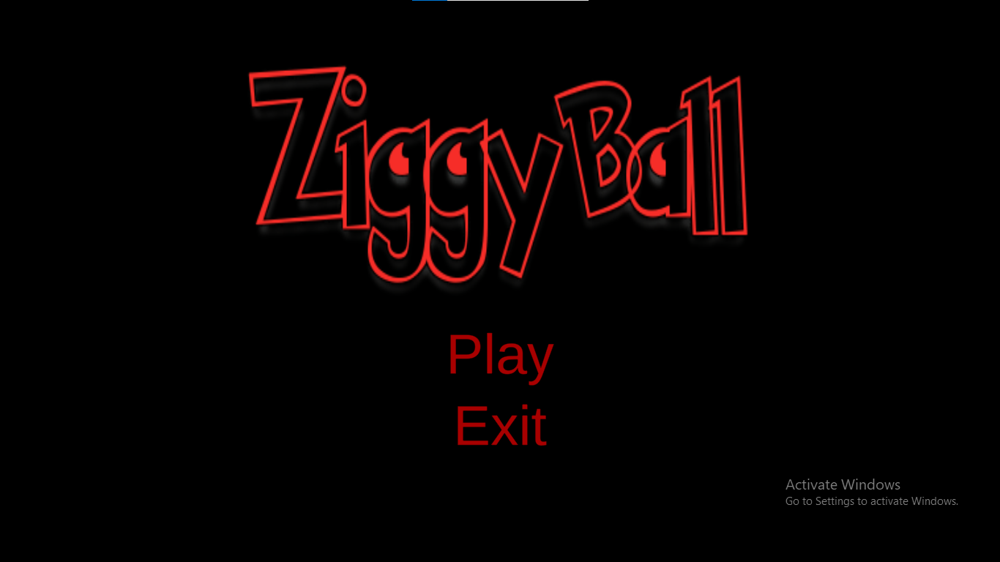
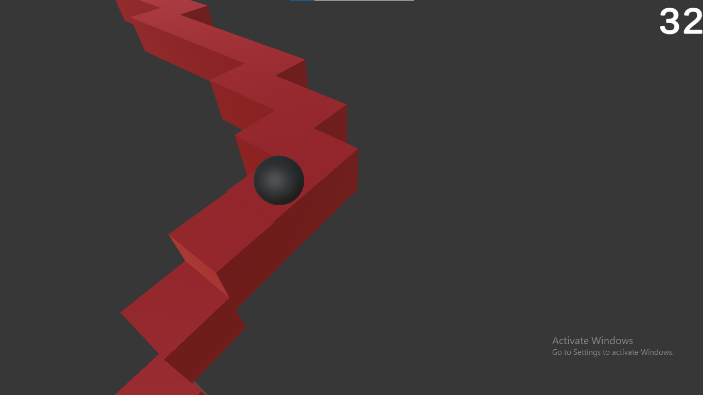
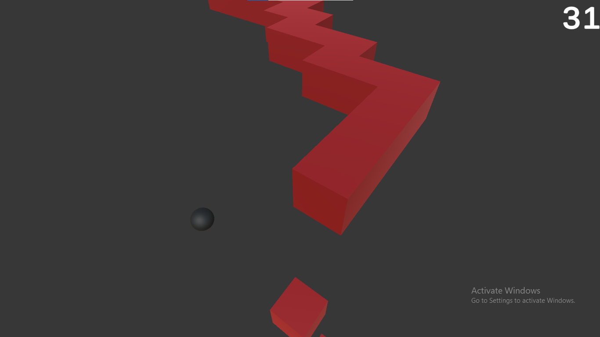

# Ziggy Ball
Arcade-style Endless Runner game.
This is a solo project.
A player controls a ball moving through a randomly generated endless zigzag path, where tiles fall behind it and movement speed increases with each direction switch, alongside a progression-based scoring system.
## Core Gameplay Mechanics
- One-click directional control
- Endless forward movement
- Zigzag path navigation
- Tiles collapsing behind the player
- Increasing speed with each direction switch
- Randomly generated path
- Progression-based scoring
- Fall-based fail state
## Controls
- Mouse left-click - Change direction
## Game Flow
- Main Menu screen with Play, Exit options and animated title text
- Endless runner game loop with score displayed
- No pause system
- Game over screen with score displayed, Restart and Main Menu options
## Technologies
- Unity
- C#
- Rigidbody Physics
- UI Canvas
- TextMeshPro
## Note
The project includes experimental UI panels (Signup, Login) created while exploring potential web-based integration. These features are not active in the current desktop version. 
## Screenshots

